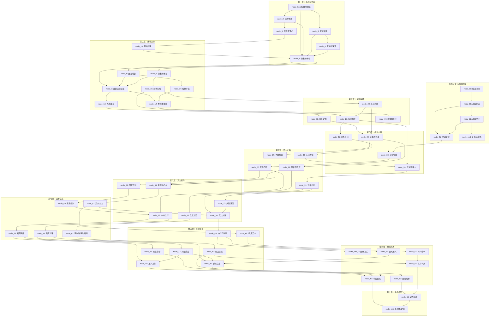

# 关卡节点流程图

## 游戏主线流程 (Mermaid)



## 节点统计

| 类别 | 数量 |
|------|------|
| 总节点数 | 56 |
| 普通节点 | 53 |
| 结局节点 | 3 |
| 随机事件 | 8 |

## 主要分支路线

### 路线A：修炼路线
```
node_1 → node_2 → node_4 → node_9 → node_15 → node_19 → node_25 → node_30 → node_26 → node_31 → node_36 → node_43
```

### 路线B：异火路线
```
node_1 → node_4 → node_7 → node_12 → node_17 → node_23 → node_27 → node_32 → node_39 → node_46 → node_52 → node_56
```

### 路线C：魂殿路线（黑暗）
```
node_1 → node_3 → node_11 → node_16 → node_22 → node_end_1
```

## 结局触发条件

| 结局节点 | 触发条件 |
|----------|----------|
| node_end_1 | 魂殿路线选择接受黑暗力量 |
| node_end_2 | 云岚宗之战选择宽恕 |
| node_end_3 | 正常游戏结束，根据修为判定最终结局类型 |
